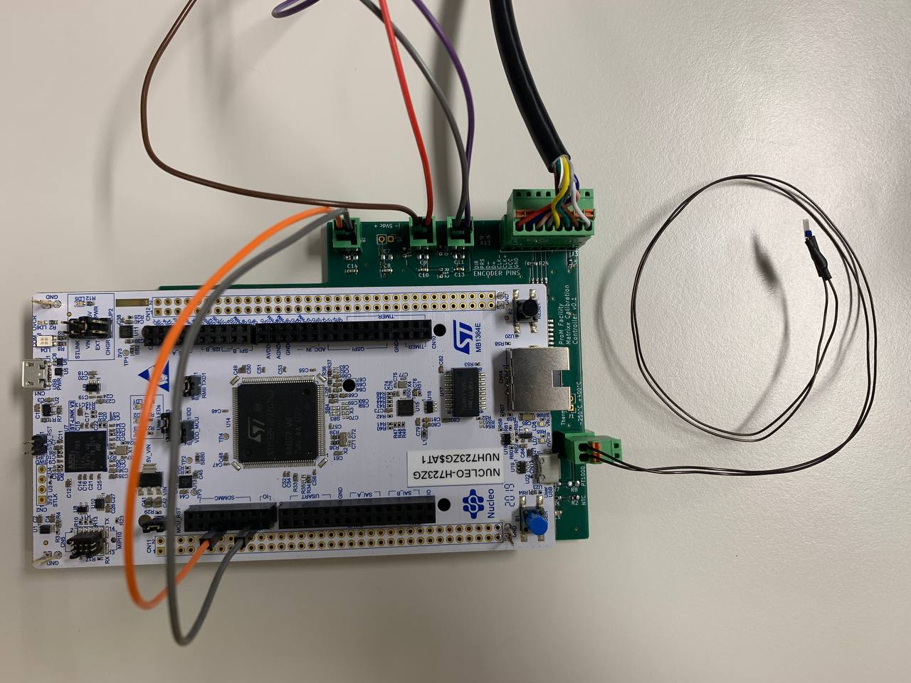

# Position-and-Temperature-Controller

## About the project 
Nowadays, more and more biomedical applications require the implementation of embedded systems, to ensure performance and reliability while keeping costs down. Currently, at the laboratories of Pro-M Facility it's developed a calibration plant for a machine used in proton therapy. 

The goal of this application is to reduce the time taken for the calibration procedure of the machinery, making the process completely autonomous and without revision, thus reducing the duration of the operation from a couple of hours to a few tens of minutes.

The project consists in the development of the measurement and control part, in support of the innovative design proposed by the company, made using: an STM32H7 microcontroller, an absolute magnetic encoder and temperature sensors.

During the entire process a bottom-up approach was used, starting from the firmware and hardware development of the individual components, and then creating interconnections between them. 

The project has been successfully completed and, at the present time, is fully integrated within the macro project of Pro-M Facility.

## Components used

Main components used for the project:
- Nucleo STM32H723ZG
- Magnetic encoder WDGA 36A
- PTC thermistor
- NTC thermistor
- Custom PCB shield
- IHM03A1 step motor driver

# The main project

The entire system is called _Matrixx_ and consists of a mechanical structure needed to support the motor and a sensors control part (this one made by us). The Python GUI and the low level drivers to drive the motor are not shown in this repo because of a nondisclosure agreement with the company. 

[Matrixx project demo video](media/Embedded%20System%20Video%20-%20Proton.mp4)

## Custom PCB shield
This PCB allows the microcontroller to handle different voltages to supply all the internal and external components (involved voltages: 3.3, 5, 24 V)  

 _The custom PCB used as shield_  

 _The control subsystem made by us_

# Build and Run
## Repo structure
    📂 Firmware
    ┣ 📂 STM F4 <- it's not the version considered in the project
    ┣ 📂 STM H7 
    📂 Hardware
    ┣ 📂 HW_Encoder_Driver_Board <- just a prototype
    ┣ 📂 HW_Temperature_Sensors_Board <- Kicad project of the PCB shield

## Build the code and run
- Open STM32 Cube IDE
- `File` > `Import` > `Existing projects into Workspace`
- Select the root directory where the project is located
- Press `Finish`

Then you can build and run using the IDE

# Report
[Full report](/Academic_Project_Report.pdf)
